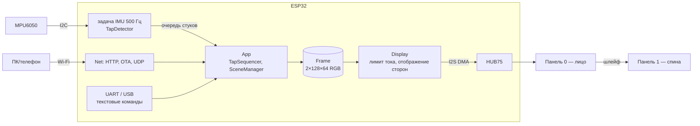

# Светильник — дизайн-документ

Статус: черновик v0.1 · 2026-09-25

## 1. Назначение
Стационарный двусторонний светильник-индикатор. Он наследует поведение v1 и служит
испытательным стендом для экранной части будущего ходока. Даёт реальные массу, габариты
и потребление.

## 2. Требования
### Функциональные
| ID | Требование | Приоритет |
|---|---|---|
| F1 | Все режимы v1: меню по наклону, плавная смена, случайный цвет, смешивание RGB наклоном, «фиолетовый в крапинку», реакция на движение | must |
| F2 | Жесты: стук, двойной, тройной (тройной из любого режима → меню) | must |
| F3 | Изображение на обеих сторонах; одинаковое или разное | must |
| F4 | Программный лимит тока панелей | must |
| F5 | Управление с телефона (веб-страница без приложения) | should |
| F6 | Прошивка по Wi-Fi (OTA) | should |
| F7 | Приём кадров с ПК по UDP (≥ 20 к/с) | should |
| F8 | UART-порт с тем же протоколом (для будущего «мозга») | should |
| F9 | Автояркость, микрофон, сенсорные зоны, MQTT/Home Assistant | could |

### Нефункциональные
- Не мерцает на глаз; частота обновления ≥ 60 Гц.
- Стук распознаётся надёжно, ложных срабатываний от шагов по полу нет (стол).
- Без Wi-Fi всё основное работает.
- Питание 12 В — такое же, как будет на ходоке (3S).

## 3. Архитектура

- **Ядро** (`lib/indicator_core`) не зависит от Arduino и тестируется на ПК.
- **Кадр** (`Frame`) описан в координатах сторон. Физическая раскладка (порядок в цепочке,
  зеркалирование) задаётся только в `Display` по `config.h`.
- **Все каналы управления** сводятся к одному текстовому протоколу (`protocol.md`).

Подробности — в [firmware.md](firmware.md).

## 4. Ключевые решения
| Решение | Почему | ADR |
|---|---|---|
| Отдельные треки: светильник, ходок | дешевле и спокойнее отлаживать, нужны реальные массы | [0001](../decisions/0001-two-tracks.md) |
| ESP32 (исходный), 6 бит цвета | плата уже есть; 96 КБ DMA + Wi-Fi помещаются | [0002](../decisions/0002-lamp-esp32-6bit.md) |
| Шина 12 В → 5 В на каждую панель | совместимо с будущим 3S; отдельные линии без просадок | [0003](../decisions/0003-power-12v-bus.md) |
| Яркость через OE, а не через значения пикселей | не теряем биты цвета | [0002](../decisions/0002-lamp-esp32-6bit.md) |
| Один текстовый протокол на всех каналах | одна точка входа, легко отлаживать | [0004](../decisions/0004-text-protocol.md) |

## 5. Интерфейсы (что можно сделать вокруг светильника)
| Интерфейс | Железо | Для чего | Этап |
|---|---|---|---|
| Стук / наклон | MPU6050 (есть), позже LIS3DH/ADXL345 с аппаратным распознаванием стука | главный «характер» | A6 |
| Веб-страница | — | режимы, цвет, яркость, лимит, консоль | A8 |
| OTA | — | прошивка без кабеля, когда рамка собрана | A8 |
| UDP-поток кадров | — | анимации с ПК, визуализации, позже — от «мозга» | A8 |
| USB/UART-консоль | — | отладка, связь с Pi | есть |
| Датчик тока | INA226 + шунт | калибровка лимитера, телеметрия | A4–A5 |
| Датчик освещённости | BH1750 (I2C) | автояркость ночью | A9 |
| Микрофон | INMP441 (I2S) | реакция на звук/голос, «настроение» по громкости | A9 |
| Сенсорные зоны | touch-пины ESP32 + медная фольга в рамке | «погладить» как альтернатива стуку | A9 |
| MQTT / Home Assistant | — | индикатор уведомлений, погоды, статусов | A9 |
| Время / NTP | — | ночной режим, часы | A9 |

Свободные после HUB75 пины и их назначение — в [hardware.md](hardware.md).

## 6. Риски
| Риск | Вероятность | Что делаем |
|---|---|---|
| Драйверы панелей не поддерживаются (ICN2153, FM6353 и др. S-PWM) | средняя | определить чипы до покупки остального; альтернатива — `esphome/esp-hub75` или замена панелей |
| Не хватает памяти при Wi-Fi | низкая | 5 бит цвета; отключить BT (уже не используется) |
| Мерцание/низкая частота на 256×64 | средняя | поднять частоту I2S, уменьшить `min_refresh_rate`, укоротить шлейф |
| GPIO12 мешает загрузке | низкая | перенести B2 на другой пин |
| Удары по корпусу вредят панелям | средняя | стучать по рамке, а не по панели; демпфирующие прокладки |
| Сплошные заливки — почти максимальный ток | высокая | лимитер тока; БП с запасом; провода 18AWG |

## 7. Открытые вопросы
- Чипы драйверов панелей и декодер строк.
- WROOM или WROVER на DevKitC.
- Одинаковая картинка на двух сторонах или «лицо/спина» (сейчас сцены рисуют одинаково).
- Нужен ли рассеиватель для режима «пятна» (как v1) — проверить на собранной рамке.
