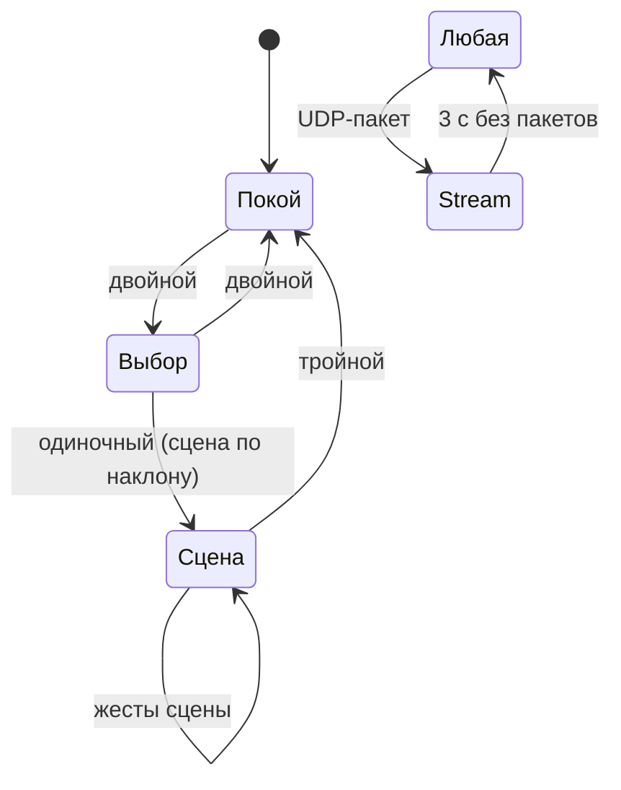

# Светильник — прошивка

Проект: `lamp/firmware/` (PlatformIO, Arduino-ESP32, espressif32 6.x).

## Окружения
| env | Что | Команда |
|---|---|---|
| `lamp` | основная прошивка | `pio run -e lamp -t upload` |
| `lamp_ota` | то же, заливка по Wi-Fi на `indicator.local` | `pio run -e lamp_ota -t upload` |
| `panel_test` | узоры для проверки панелей ([bringup.md](bringup.md)) | `pio run -e panel_test -t upload` |
| `native` | тесты ядра на ПК | `pio test -e native` |

## Слои
```
src/main.cpp      setup/loop, чтение строк команд с USB и UART
src/app/App       владеет кадром, сценами, секвенсором; tick() и execute()
src/hw/Display    HUB75 через ESP32-HUB75-MatrixPanel-DMA, лимитер, раскладка сторон
src/hw/Imu        MPU6050 в задаче FreeRTOS 500 Гц, TapDetector, фильтр гравитации
src/net/Net       Wi-Fi/AP, mDNS, OTA, HTTP (/, /api/cmd, /api/status), UDP :7777
lib/indicator_core   без Arduino: Color, Frame, Taps, Tilt, Power, Command, Scene(s), FramePacket
```

### Цикл
- `loop()` → разбор команд (USB, UART) → `Net::poll()` (HTTP, OTA, UDP) → `App::tick()`.
- `App::tick()`: забрать стуки из очереди IMU → `TapSequencer` → жесты в `SceneManager`;
  раз в 33 мс нарисовать сцену в `Frame` и отдать в `Display::present()`.
- Всё, кроме IMU, в одном потоке (ядро 1) — блокировки не нужны.
- Задача IMU — на ядре 0, передаёт стуки через очередь, гравитацию — под спинлоком.

### Память (оценка)
| Что | Размер |
|---|---|
| DMA-буфер 256×64, 6 бит | ~96 КБ (16 КБ на бит) |
| `Frame` 2×128×64×3 | 48 КБ |
| Wi-Fi + lwIP + веб-сервер | ~50–70 КБ |
Фактические числа печатаются при старте и по команде `status` (`heap`, `dma_heap`).

## Сцены
Порядок меню повторяет v1 (цвет-превью при наклоне):

| # | Имя | Превью | Поведение | Жесты |
|---|---|---|---|---|
| 0 | `menu` | — | покой: «дышащий» синий; выбор: превью сцены + точки-позиция | двойной: покой↔выбор; одиночный в выборе: запуск |
| 1 | `smooth` | белый | плавный переход между случайными цветами, 3,5 с | — |
| 2 | `solid` | красный | один цвет | одиночный: новый случайный |
| 3 | `tiltcolor` | радуга | наклон в 3 стороны добавляет R/G/B; упор в канал гасит остальные | двойной: зафиксировать (моргнёт 2 раза) / отпустить |
| 4 | `speckles` | фиолетовый | фиолетовый в зелёную крапинку, крапинки мерцают | одиночный: перемешать |
| 5 | `motion` | голубой | спокойно = голубой, трясут = красный | — |
| — | `stream` | — | кадры по UDP; через 3 с тишины возврат к прошлой сцене | — |

Глобально: **тройной стук из любой сцены → меню** (как `hit_back_to_default` в v1).



## Стуки
Два этапа, оба в ядре и покрыты тестами:
1. `TapDetector` (500 Гц, задача IMU): |a| минус адаптивная база. Больше 5 м/с² — стук
   (если прошло ≥ 60 мс от прошлого), новый стук разрешается, когда отклонение упадёт ниже 3 м/с².
   База медленно следует за |a| в покое: неточная калибровка датчика не даёт ложных стуков.
2. `TapSequencer`: стуки ближе 150 мс — дребезг; пауза > 600 мс завершает серию → жест
   (1/2/3/≥4). Поэтому одиночный стук срабатывает с задержкой 0,6 с (как в v1).

Отличия от v1: датчик читается 500 раз в секунду (в v1 — раз в ~30 мс с фильтром 21 Гц,
короткие стуки размывались), полоса фильтра MPU6050 94 Гц.

Настройка порогов — в `TapDetectorConfig` / `TapSequencerConfig` (`Taps.h`).

## Лимит тока
`Power.h`: `I = idle + k · Σ linear(канал) · brightness/255`, где `linear()` — та же
CIE-кривая, что применяет драйвер. Перед каждым кадром считается нагрузка кадра и
понижается общая яркость (OE), если оценка превышает лимит. Коэффициенты `kIdleCurrentMa`
и `kMaPerChannelFull` в `config.h` — заглушки до замера ([bringup.md](bringup.md), шаг 6).

## Как добавить сцену
1. Класс-наследник `ind::Scene` в `Scenes.h/.cpp` (или отдельный файл в ядре).
2. `name()`, `previewColor()`, `render()`; по желанию `enter()`, `onGesture()`, `onTap()`.
3. Добавить экземпляр в `App` и `mgr_.add(...)` в `App::begin()` (порядок = порядок в меню).
4. Тест в `test/test_core/test_main.cpp`, если есть логика.
5. Строку в таблицу выше.
