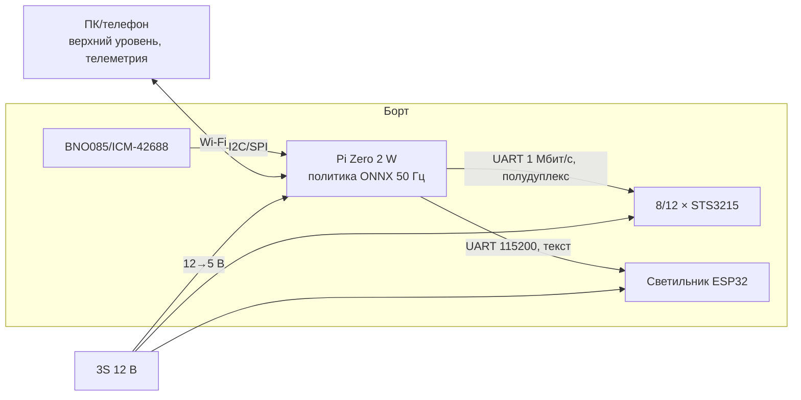

# Ходок — дизайн-документ

Статус: черновик v0.1 · 2026-09-25 · трек начинается после этапа A7 (известна масса светильника)

## 1. Назначение
Четвероногая платформа, которая несёт светильник и ходит «живо» за счёт походки,
обученной с подкреплением (RL). До объединения со светильником её испытывают с грузом-макетом
той же массы и габаритов.

## 2. Стадии
| Стадия | Ноги | Серво | Что умеет | Зачем |
|---|---|---|---|---|
| **1** | 2DOF-пятизвенник, ноги разведены на фиксированный угол | 8 × STS3215 | вперёд/назад, повороты за счёт разной длины шага, приседания, «жесты» телом | дешевле, проще модель, быстрее RL; проверка всей цепочки sim2real |
| **2** | 3DOF: + отведение бедра | 12 × STS3215 | + шаг вбок, поворот на месте, поперечный баланс, толчки | полноценная ловкость |

Переход без переделки ног: узел бедра модульный. На стадии 1 между корпусом и бедром
стоит печатная вставка размером с серво, на стадии 2 её заменяет серво (ADR 0006).
Почему именно так — [kinematics.md](kinematics.md).

## 3. Требования
| ID | Требование | Стадия |
|---|---|---|
| W1 | Несёт груз = светильник (оценка 1,5 кг, уточнить) | 1 |
| W2 | Стоит без питания серво не падая (или ложится мягко) | 1 |
| W3 | Ходит вперёд/назад ≥ 0,1 м/с по ровному полу | 1 |
| W4 | Поворачивает (радиус ≤ 0,5 м на стадии 1, на месте на стадии 2) | 1/2 |
| W5 | Переносит толчок/стук без падения | 2 |
| W6 | Работа от аккумулятора ≥ 1 ч ходьбы | 1 |
| W7 | Аварийное отключение питания серво кнопкой | 1 |
| W8 | Нижний уровень управления (50 Гц) на борту; верхний — можно на ПК/телефоне | 1 |

## 4. Бюджет массы (оценка, обновлять по [lamp/measurements.md](../lamp/measurements.md))
| Узел | Стадия 1, г | Стадия 2, г |
|---|---|---|
| Светильник (2 панели ~1000–1200, рамка ~300, электроника ~100) | 1500 | 1500 |
| Аккумулятор 3S2P 21700 + BMS | 450 | 450 |
| Серво STS3215 × 8 / × 12 (55 г) | 440 | 660 |
| Ноги: трубки, шарниры, подшипники, стопы (4 шт) | 250 | 250 |
| Узлы бедра, кронштейны, вставки/отведение | 250 | 300 |
| Pi Zero 2 W, IMU, преобразователи, проводка | 150 | 150 |
| **Итого** | **≈ 3,0 кг** | **≈ 3,3 кг** |

## 5. Архитектура

Детали: [actuators-power.md](actuators-power.md), [control-rl.md](control-rl.md),
[integration.md](integration.md).

## 6. Риски
| Риск | Что делаем |
|---|---|
| Моментов STS3215 не хватает при 3+ кг | пятизвенник (оба серво держат вес), короткие звенья, B0 — проверка в симуляции до покупки; запасной вариант — Feetech на 40–50 кг·см |
| Узкий высокий корпус → поперечная неустойчивость | развал ног, аккумулятор внизу; стадия 2 решает активно |
| sim2real не сходится | идентификация серво на стенде (B1), рандомизация, опыт Open Duck Mini |
| Перегрев серво при стоянии | лечь при простое; ограничение момента; мониторинг температуры из серво |
| Политика дёргается на железе | штраф за скорость изменения действий, фильтр действий, аварийное отключение |
| Удары по светильнику во время ходьбы = помехи | стуки ловить по IMU ходока + нагрузке серво |

## 7. Открытые вопросы
- Длины звеньев — по результатам B0 (симуляция) и B1 (стенд).
- IMU: BNO085 (готовая ориентация) или ICM-42688 (сырые данные, быстрее) — решить к B2.
- Ноги в плоскости длинной стороны (как у собаки) или поперёк — по устойчивости в B0.
